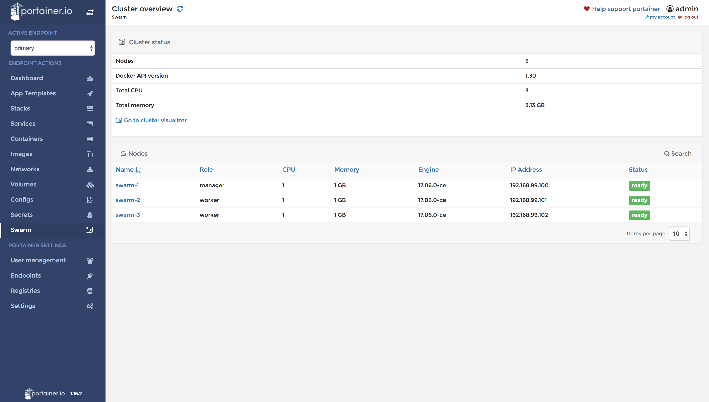
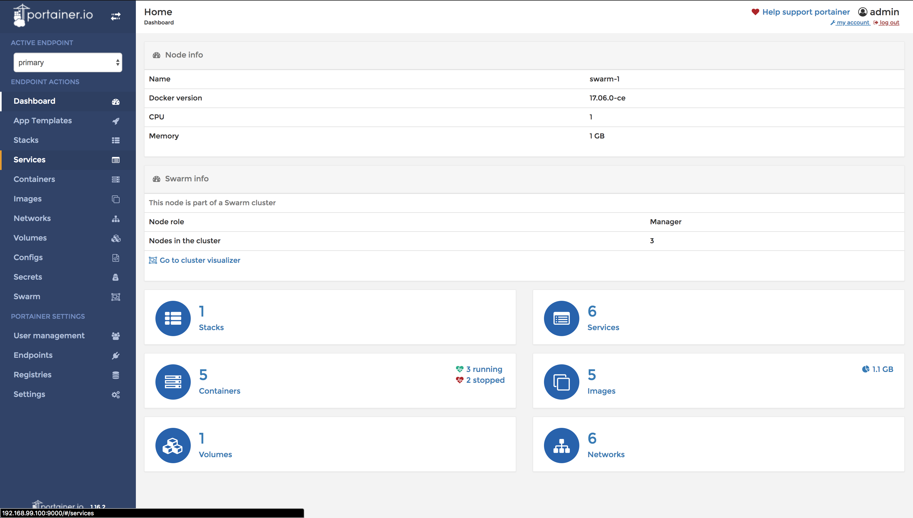
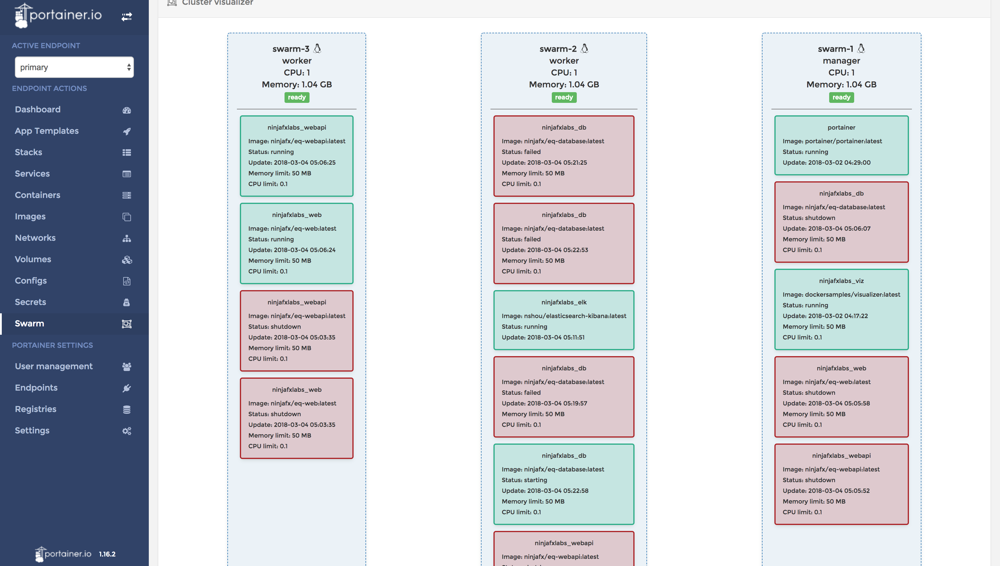
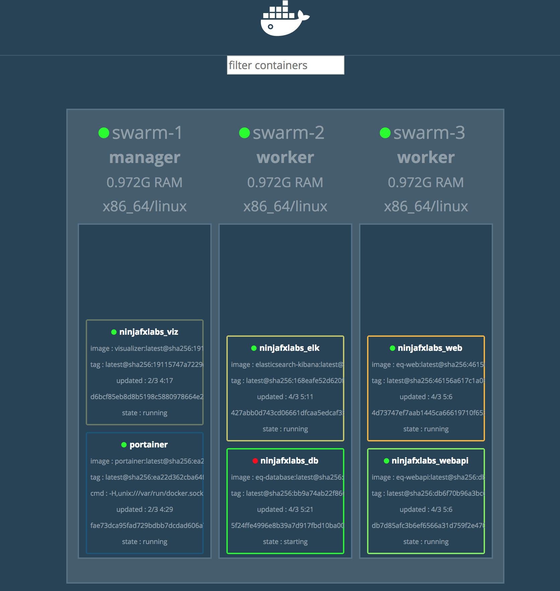

## Case Studies  of Full  Scalable & Flexible  Architecture

## How to use:
- You will need Visual Studio 2017 (preview 15.3) and the .NET Core SDK (released in August 14, 2017).
- The latest SDK and tools can be downloaded from https://dot.net/core. 
- Read the .NET Core 2.0 [release announcement](https://blogs.msdn.microsoft.com/dotnet/2017/08/14/announcing-net-core-2-0/) for more information.

Also you can run the Equinox Project in Visual Studio Code (Windows, Linux or MacOS).

To know more about how to setup your enviroment visit the [Microsoft .NET Download Guide](https://www.microsoft.com/net/download)

## How to setup via local:

- open to the .vscode/launch.json and run web.dll or webapi.dll
- you should be run these commands for dependencies of project
- after that you should set localhost to the connectionstring and elasticsearchurl instead of db and elk
- UI.Site/Program/ContentRoot(Directory.GetCurrentDirectory()) should be Directory.GetCurrentDirectory()+"/src/Equinox.UI.Site"

```sh
$ docker run -e 'ACCEPT_EULA=Y' -e 'SA_PASSWORD=testuser123!' -p 1433:1433 -d ninjafx/eq-database:latest
$ docker run -d -p 9200:9200 -p 5601:5601 nshou/elasticsearch-kibana 
```


## How to setup via docker compose:

```sh
$ cd /deploy/docker-compose
$ docker-compose pull
$ docker-compose build
$ docker-compose up
```
For stop all containers
```sh
$ docker-compose down
```


And open links below as ;
- Api -> localhost:8003/swagger
- connect to DB -> localhost:1433 | user:sa | password:testuser123!
- logging -> localhost:5601 (you need set index as logstash-* by @timestamp AND product by @timestamp (after any perform request and It will create index as product automatically))

## How to setup via docker swarm:

```sh
$ cd /deploy/docker-swarm
$ sh setup.sh
$ docker service scale {service_name}={replica_num}
```
And open links below as ;
- Api -> 192.168.99.100,101:8003/swagger
- connect to DB -> 192.168.99.100,101:1433 | user:sa | password:testuser123!
- portainer (container dashboad UI) -> 192.168.99.100,101:9000
    - choose an user(admin) and password(12345678) when entrance to portainer registeration page 
    - and select to local for connect
    - and you can show all nodes from cluster if click go to cluster visualizer from Dashboard
- logging -> 192.168.99.100,101:5601 (you need set index as logstash-* by @timestamp AND product by @timestamp (after any perform request and It will create index as product automatically))

- PLEASE SHOULD BE RUNNING STATE OF DOCKER-MACHINES
- if you got error about machine driver as "Unable to query docker version ..." then run command as below ;

```sh
docker-machine regenerate-certs swarm-1
docker-machine regenerate-certs swarm-2
docker-machine regenerate-certs swarm-3
```

For stop all containers
```sh
$ cd/deploy/docker-swarm
$ sh kill.sh
```
## The Screenshots of System Infrastructure 
 
 
 
 


## Technologies implemented:

- ASP.NET Core 2.0 (with .NET Core)
 - ASP.NET MVC Core 
 - ASP.NET WebApi Core
- Entity Framework Core 2.0
- .NET Core Native DI
- AutoMapper
- FluentValidator
- MediatR
- Swagger UI

## Architecture:

- Full architecture with responsibility separation concerns, SOLID and Clean Code
- Domain Driven Design (Layers and Domain Model Pattern)
- Domain Events
- Domain Notification
- CQRS (Imediate Consistency)
- Event Sourcing
- Unit of Work
- Repository and Generic Repository

## Deployment:
- Docker Compose
- Docker Swarm Mode on VMBox (as virtualbox etc...)

## About:
The Equinox Project was developed by [Bilal İslam] under the [MIT license](LICENSE).
